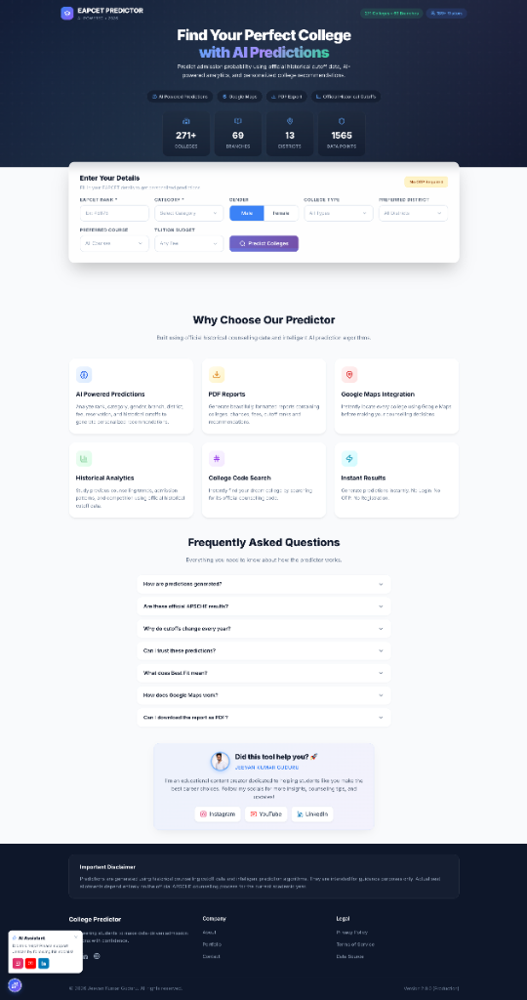

# 🚀 AP EAPCET (EAMCET) College Predictor 2026

An advanced, highly-accurate College Predictor built specifically for AP EAPCET engineering admissions. It leverages real historic cutoff data (2024), dynamic rank-based probability scoring, and a beautiful interactive interface to help students discover their best-fit colleges, branches, and districts.

 
<h2 align="center">📱 Application Showcase</h2>

  <strong>🔥 Live Website: <a href="https://ap-eamcet-college-predictor.vercel.app/">https://ap-eamcet-college-predictor.vercel.app/</a></strong>

  

 

## ✨ Key Features
- **Intelligent Forecasting Engine**: Custom algorithm mapping student ranks, categories, and budgets to true admission probabilities.
- **Extensive Data Coverage**: Integrated with official 2024 cutoff datasets covering 271+ colleges and 69 branches across 13 districts.
- **Multi-Dimensional Filtering**: Seamlessly filter results with multi-select dropdowns for courses, districts, college types, and dynamic tuition budget ranges.
- **Premium PDF Dossier Generation**: Export personalized, color-coded admission prediction reports natively rendered in PDF format, complete with candidate profiles and dynamic data grids.
- **Lightning-Fast Architecture**: Engineered with lazy-loading data pipelines for instant Time-To-Interactive (TTI) performance without blocking the main thread.
- **Progressive Web App (PWA) Ready**: Installable native mobile experience with advanced SEO, Open Graph preview cards, and mobile-optimized interfaces.
- **Personalized Counseling Simulator**: Predict exact admission outcomes for Round 1, Round 2, and Final Phase counseling (Coming Soon).
- **Premium User Experience**: Built with modern React, TailwindCSS, and Framer Motion for a breathtaking, modern corporate aesthetic.

## ⚠️ Copyright & License Notice

**© 2026 Jeevan Kumar Guduru. All Rights Reserved.**

This repository and all of its underlying source code, assets, algorithms, and proprietary data structures are the exclusive intellectual property of **Jeevan Kumar Guduru**. 

- ❌ **No one is allowed to use, copy, distribute, modify, or host this code.**
- ❌ **Commercial and non-commercial usage of this repository is strictly prohibited.**
- ❌ **This project does NOT have an open-source license.**

*If you are interested in collaboration, sponsorship, or usage rights, please reach out via my official channels below.*

## 📬 Connect With Me (Creator)
I'm an educational content creator dedicated to helping students make the best career choices. If this tool helped you, please consider supporting me by following my official channels!

- 📸 **Instagram**: [@jeevankumarguduru_official](https://www.instagram.com/jeevankumarguduru_official?igsh=dHRhbjBwZHdkNmRx&utm_source=qr)
- 🎥 **YouTube**: [Jeevan Kumar Guduru](https://www.youtube.com/@JeevanKumarGuduru)
- 💼 **LinkedIn**: [Guduru Jeevan Kumar](https://www.linkedin.com/in/gudurujeevankumar/)
- 📧 **Email**: [jeevankumarguduru3@gmail.com](mailto:jeevankumarguduru3@gmail.com)
